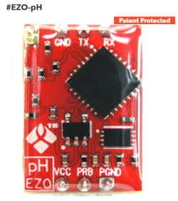
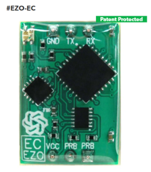
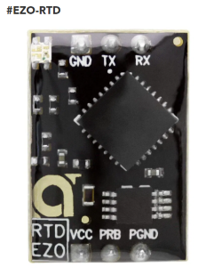
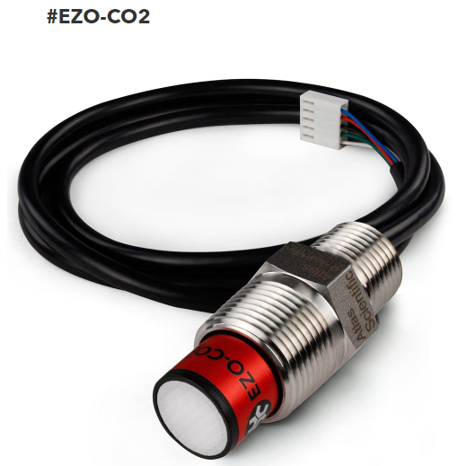
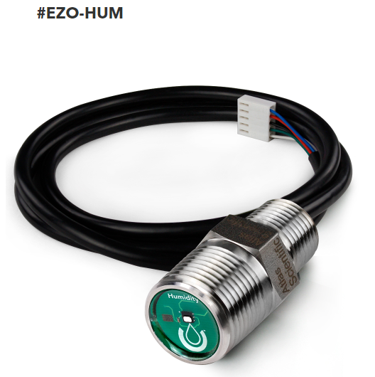
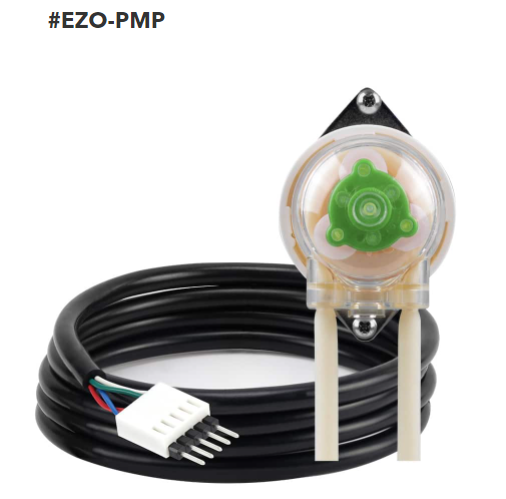
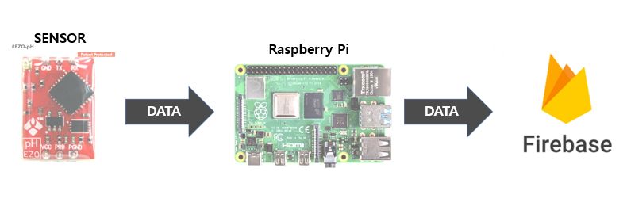

# SmartFarmProject
### 주제: 센서와 Raspberry Pi를 사용하여 농작물 재배 자동화
## Sensor
* pH
  - 액체 내 수소이온 농도를 나타내는 지표
  - Reads: pH
  - Range: 0 ~ 14
  - 관련 링크: https://atlas-scientific.com/embedded-solutions/ezo-ph-circuit/
  
* EC
  - 전도도
  - Reads
    + Conductivity = μS/cm
    + Total dissolved solids = ppm
  - Range: 	0.07 − 500,000+ μS/cm
  - 관련 링크: https://atlas-scientific.com/embedded-solutions/ezo-conductivity-circuit/
  
* RTD
  - 온도
  - Reads: Temperature
  - Range: -126.000 °C − 1254 °C
  - 관련 링크: https://atlas-scientific.com/embedded-solutions/ezo-rtd-temperature-circuit/
  
* CO2
  - 대기 중 CO2
  - CO2 측정을 위해 IR light(적외선) 사용
  - 대기 중 CO2를 측정하는 것으로 물에 담그지 말 것!
  - Reads: Gaseous CO2
  - Range: 0 - 10,000 ppm
  - 관련 링크: https://atlas-scientific.com/probes/co2-sensor/
  
* HUM
  - 습도
  - 물속에서는 값이 100%로 return
  - Reads: Relative humidity, Dew point, Air temperaute
  - Range: 0 - 100%
  - 관련 링크: https://atlas-scientific.com/probes/humidity-sensor/
  
* PMP
  - 펌프
  - Flow rate:	0.5ml to 105ml/mins
  - 측정값은 1% 내외로 오차가 있음 
  - 관련 링크: https://atlas-scientific.com/peristaltic/ezo-pmp/
  
## Sensor 사용방법
### 필요 물품: 보드(RaspberryPi or Arduino), Jumper Cable, Bread Board
* 통신 방식 변경: UART -> I2C
  - pH, EC Sensor: Breadboard에서 점퍼 케이블로 TX와 PGND를 연결
  - RTD Sensor: Breadboard에서 점퍼 케이블로 TX와 PRB를 연결
  - CO2, HUM, PMP Sensor: Breadboard에서 점퍼 케이블로 TX(초록색 선)와 INT(파란색 선)를 연결
## Firebase 사용
* 센서들로부터 읽어들인 데이터를 Firebase에 저장
  - 12시 ~ 18시: 5분 단위로 데이터를 Firebase에 저장
  - 이외 시간: 30분 단위로 데이터를 Firebase에 저장
## 작동 원리
1. Raspberry Pi의 전원이 켜지면 Wifi 설정 터미널이 실행됨
2. Wifi 설정
    - 이미 등록된 Wifi가 있다면 몇 초간 대기 후 센서로부터 읽은 데이터를 Firebase에 데이터를 등록함
    - 등록된 Wifi가 없다면 Wifi 등록을 위한 ID와 PW를 입력하고 자동으로 재부팅함

